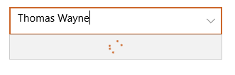
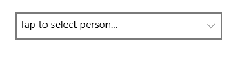
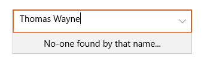

[](https://dev.azure.com/hoveytech/SearchableComboBox/_build/latest?definitionId=9?branchName=master)

# Searchable ComboBox for UWP

Single UserControl that includes:
* TextBox for filter input
* ProgressRing for async/background search

Minimum Supported UWP Build: 15063

## Getting Started

### Install using NuGet: 

`Install-Package HoveyTech.SearchableComboBox.UWP`

### Basic setup:

Setup binding for `SelectedEntity`, `FilterText` and `List`.
```xml
 <uwp:SearchableComboBox SelectedItem="{Binding SelectedEntity, Mode=TwoWay}"
        FilterText="{Binding FilterText, Mode=TwoWay,UpdateSourceTrigger=PropertyChanged}"
        ItemsSource="{Binding List}">
</uwp:SearchableComboBox >
```                            

NOTE: UserControl does not filter `ItemsSource`. The ViewModel must filter `ItemsSource` using `FilterText` property and update `List` property.

## ProgressRing



Set `UseLoadingProgressRing` to `True`. Whenever `FilterText` changes on ViewModel update `IsRefreshingItemsSource` binding.
```xml
 <uwp:SearchableComboBox SelectedItem="{Binding SelectedEntity, Mode=TwoWay}"
        FilterText="{Binding FilterText, Mode=TwoWay,UpdateSourceTrigger=PropertyChanged}"
        ItemsSource="{Binding List}"
        UseLoadingProgressRing="True"
        IsRefreshingItemsSource="{Binding IsSearching}">
</uwp:SearchableComboBox >
```                            
## PlaceHolder & No items message

**PlaceHolder:**





Set `PlaceholderText` to custom message (default: empty). Set `ItemsSourceEmptyMessage` to custom message (default: `"No items..."`).
```xml
 <uwp:SearchableComboBox SelectedItem="{Binding SelectedEntity, Mode=TwoWay}"
        FilterText="{Binding FilterText, Mode=TwoWay,UpdateSourceTrigger=PropertyChanged}"
        ItemsSource="{Binding List}"
        PlaceholderText="Tap to select person..."
        ItemsSourceEmptyMessage="No-one found by that name...">
</uwp:SearchableComboBox >
```                            